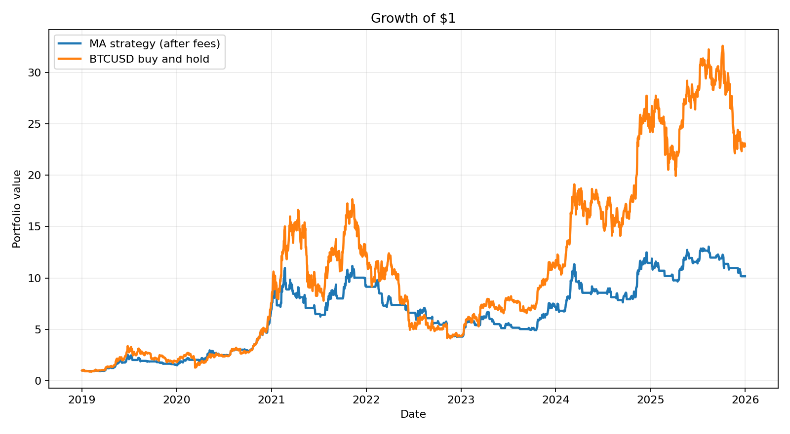
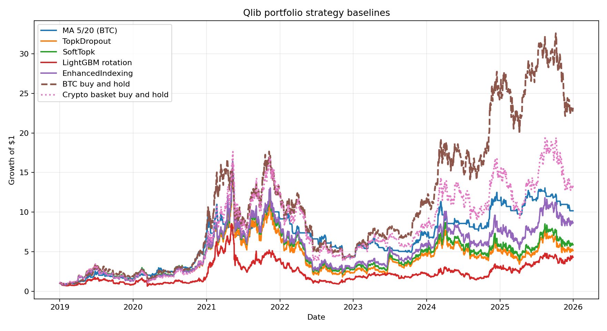
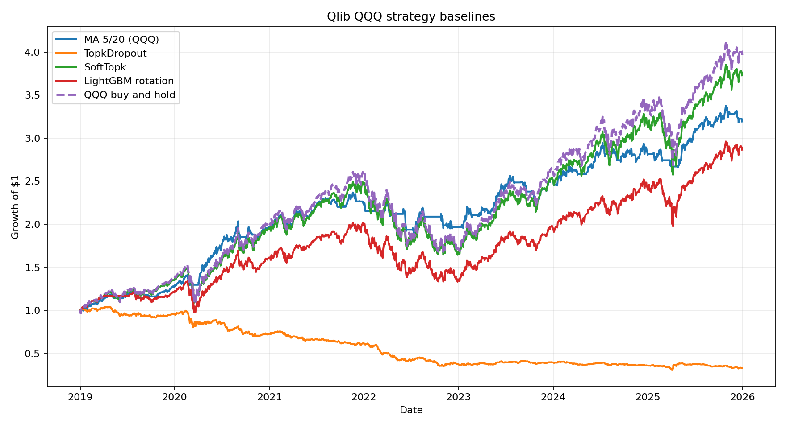
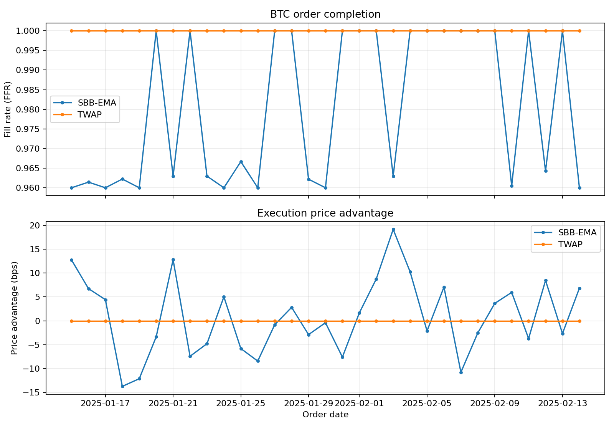

# Simple moving-average strategy

This beginner example holds one stock when its 5-day simple moving average is
above its 20-day average, and otherwise holds cash. Signals are delayed by one
day to prevent look-ahead bias.

## 1. Install Qlib and download the sample data

From the repository root:

```bash
python -m pip install -e .
python scripts/get_data.py qlib_data --target_dir ~/.qlib/qlib_data/cn_data --region cn
```

## 2. Run the backtest

```bash
python examples/simple_ma/run.py
```

Try other windows or another instrument:

```bash
python examples/simple_ma/run.py --fast 10 --slow 50 --instrument SH600519
```

The example is deliberately small: `strategy.py` contains the trading rule and
`run.py` contains the Qlib initialization, simulator, costs, and result summary.
It is educational code, not investment advice.

## Bitcoin with daily OHLCV candles

Download public BTC-USD candles from Coinbase Exchange and convert them to
Qlib's native binary format:

```bash
python examples/simple_ma/prepare_bitcoin_data.py --start 2017-01-01 --end 2026-01-01
```

Then run the moving-average strategy. It uses yesterday's close-derived signal
and trades at the next daily open, supports fractional BTC, and applies a 0.1%
fee on both buys and sells:

```bash
python examples/simple_ma/run.py \
  --provider-uri .data/bitcoin/qlib \
  --instrument BTCUSD \
  --benchmark BTCUSD \
  --region us \
  --start 2019-01-01 \
  --end 2025-12-31 \
  --deal-price open \
  --trade-unit 0 \
  --open-cost 0.001 \
  --close-cost 0.001 \
  --min-cost 0 \
  --figure examples/simple_ma/bitcoin_returns.png
```

The figure plots the growth of $1 in the moving-average strategy after trading
fees against a buy-and-hold baseline using BTCUSD's daily benchmark returns.
Both series use the same 2,557 daily sessions from 2019-01-01 through
2025-12-31, matching the portfolio baseline suite below:



The raw `volume` field is BTC traded on Coinbase. The dataset is suitable for
testing and education; results from one venue do not represent the entire
Bitcoin market.

## Strategy baseline suite

Qlib's strategies solve two different problems, so the baseline suite reports
them separately:

- portfolio strategies decide what to own: 5/20 MA, `TopkDropoutStrategy`,
  `SoftTopkStrategy`, `EnhancedIndexingStrategy`, and a rolling LightGBM
  rotation model;
- execution strategies decide how to fill an existing order: `TWAPStrategy`
  and `SBBStrategyEMA`.

### Portfolio baselines

Download daily OHLCV candles for a four-asset Coinbase basket. The downloader
also writes a 25%-per-asset `$crypto_weight` field for the enhanced-indexing
benchmark:

```bash
python examples/simple_ma/prepare_bitcoin_data.py \
  --start 2018-01-01 \
  --end 2026-01-01 \
  --output-dir .data/crypto_baselines \
  --products BTC-USD ETH-USD LTC-USD BCH-USD
```

Run the portfolio strategies. The rule-based cross-sectional strategies use a
20-day momentum score. The LightGBM experiment retrains every 90 days, predicts
five-day open-to-open returns from lagged OHLCV features, and holds the
highest-scored asset for at least five days. All strategies trade at the next
daily open, use a 0.1% fee in each direction, and compare against BTC and
equal-weight crypto buy-and-hold baselines:

```bash
python examples/simple_ma/run_strategy_baselines.py
```

The test covers 2,557 daily sessions from 2019-01-01 through 2025-12-31. The
runner builds a rolling 60-day, two-factor statistical risk model for
`EnhancedIndexingStrategy`. Results are after transaction fees; annualization
uses 365 crypto sessions:

| Strategy | Growth of $1 | Annualized return | Sharpe | Max drawdown |
| --- | ---: | ---: | ---: | ---: |
| MA 5/20 (BTC) | 10.17 | 39.24% | 0.99 | -61.77% |
| TopkDropout | 5.14 | 26.34% | 0.71 | -88.38% |
| SoftTopk | 5.87 | 28.75% | 0.73 | -86.89% |
| LightGBM rotation | 4.29 | 23.13% | 0.68 | -89.37% |
| EnhancedIndexing | 8.64 | 36.05% | 0.79 | -85.46% |
| BTC buy-and-hold | 22.87 | 56.32% | 1.04 | -76.67% |
| Crypto basket buy-and-hold | 13.34 | 44.74% | 0.88 | -78.70% |



These are strategy-integration baselines, not tuned trading systems. In this
sample, the simple rolling LightGBM model is a useful negative result: it runs
through Qlib's backtest stack without look-ahead, but it does not beat either
BTC buy-and-hold or the equal-weight crypto basket.

### QQQ portfolio baselines

The same daily portfolio experiment can also run on Yahoo Finance OHLCV data.
The QQQ run uses actual Yahoo trading dates as the Qlib calendar so US market
holidays are not treated as tradable sessions:

```bash
python examples/simple_ma/prepare_yahoo_data.py \
  --start 2018-01-01 \
  --end 2026-01-01 \
  --output-dir .data/qqq \
  --symbols QQQ
python examples/simple_ma/run_strategy_baselines.py \
  --provider-uri .data/qqq/qlib \
  --start 2019-01-01 \
  --end 2025-12-31 \
  --data-start 2018-01-01 \
  --instruments QQQ \
  --benchmark QQQ \
  --benchmark-name "QQQ buy and hold" \
  --annualization-days 252 \
  --title "Qlib QQQ strategy baselines" \
  --riskmodel-root .data/qqq/riskmodel \
  --output-dir examples/simple_ma/qqq_baseline_results \
  --ml-cash-threshold
```

This single-asset run covers 1,760 QQQ trading sessions from 2019-01-02
through 2025-12-31. `EnhancedIndexingStrategy` is skipped because Qlib's
enhanced-indexing implementation requires a multi-asset universe. Results are
after transaction fees; annualization uses 252 equity sessions:

| Strategy | Growth of $1 | Annualized return | Sharpe | Max drawdown |
| --- | ---: | ---: | ---: | ---: |
| MA 5/20 (QQQ) | 3.19 | 18.08% | 1.23 | -20.06% |
| TopkDropout | 0.33 | -14.62% | -0.87 | -70.54% |
| SoftTopk | 3.73 | 20.74% | 0.95 | -33.99% |
| LightGBM rotation | 2.87 | 16.27% | 0.80 | -33.96% |
| QQQ buy-and-hold | 3.97 | 21.81% | 0.94 | -35.62% |



The QQQ results tell a slightly different story than BTC: buy-and-hold still
has the highest terminal value, while the 5/20 moving-average rule has lower
growth but materially lower drawdown and a higher Sharpe ratio over this
sample. The LightGBM run is again a simple reproducible ML baseline rather than
a tuned model.

### Execution baselines

Download hourly BTC-USD OHLCV candles and run one 0.05 BTC buy order per day.
Each order is handed to either TWAP or SBB-EMA for execution over 24 hourly
bars:

```bash
python examples/simple_ma/prepare_bitcoin_intraday_data.py \
  --start 2025-01-01 \
  --end 2025-03-01
python examples/simple_ma/run_execution_baselines.py
```

The execution test uses 31 orders from 2025-01-15 through 2025-02-14:

| Strategy | Mean fill rate | Mean price advantage |
| --- | ---: | ---: |
| TWAP | 100.00% | 0.00 bps |
| SBB-EMA | 98.02% | 0.87 bps |

Price advantage is direction-adjusted relative to the order's TWAP price;
positive is better. SBB-EMA sometimes leaves a small fraction unfilled because
its alternating-bar schedule does not force every buy remainder into the final
bar. This is useful behavioral coverage rather than a claim that one month of
orders establishes execution superiority.



Machine-readable results are written to `baseline_results/portfolio_metrics.csv`,
`baseline_results/portfolio_growth.csv`,
`baseline_results/lightgbm_feature_importance.csv`,
`baseline_results/execution_metrics.csv`, and
`baseline_results/execution_summary.csv`.
